# Proxmox Admin CLI - Functional Specification

**Version:** 1.2.0
**Last Updated:** 2026-02-16
**Status:** Production Ready

> **Single Source of Truth**: This document is the authoritative reference for all Proxmox Admin CLI features. Other documentation files (README.md, CLAUDE.md) should reference this document for feature details.

---

## Table of Contents

1. [Architecture Overview](#1-architecture-overview)
2. [Command Structure](#2-command-structure)
3. [VM Selection System](#3-vm-selection-system)
4. [Snapshot Operations](#4-snapshot-operations)
5. [Backup Operations](#5-backup-operations)
6. [VM Lifecycle Operations](#6-vm-lifecycle-operations)
7. [Cluster Operations](#7-cluster-operations)
8. [Node Operations](#8-node-operations)
9. [Container Operations](#9-container-operations)
10. [Configuration](#10-configuration)
11. [CLI Reference](#11-cli-reference)

---

## 1. Architecture Overview

### System Architecture

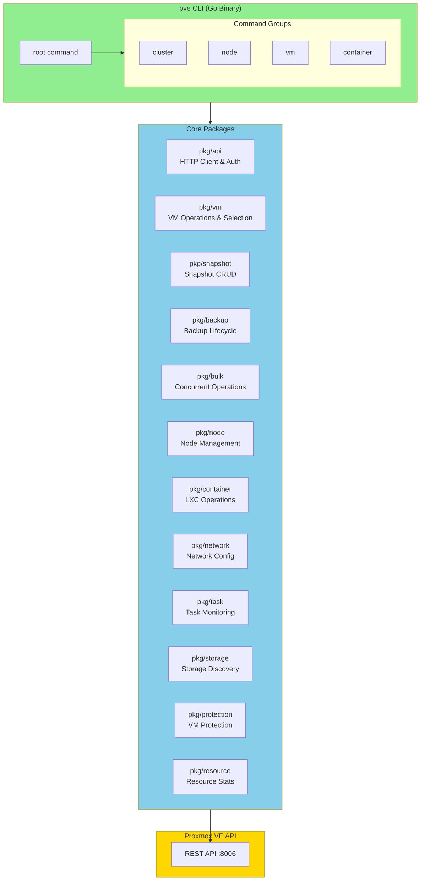
```mermaid
graph TB
    subgraph CLI["pve CLI (Go Binary)"]
        ROOT[root command]

        subgraph GROUPS["Command Groups"]
            CLUSTER[cluster]
            NODE[node]
            VM[vm]
            CONTAINER[container]
        end

        ROOT --> GROUPS
    end

    subgraph PKG["Core Packages"]
        API[pkg/api<br/>HTTP Client & Auth]
        VM_PKG[pkg/vm<br/>VM Operations & Selection]
        SNAP_PKG[pkg/snapshot<br/>Snapshot CRUD]
        BACKUP_PKG[pkg/backup<br/>Backup Lifecycle]
        BULK_PKG[pkg/bulk<br/>Concurrent Operations]
        NODE_PKG[pkg/node<br/>Node Management]
        CT_PKG[pkg/container<br/>LXC Operations]
        NET_PKG[pkg/network<br/>Network Config]
        TASK_PKG[pkg/task<br/>Task Monitoring]
        STORAGE_PKG[pkg/storage<br/>Storage Discovery]
        PROTECT_PKG[pkg/protection<br/>VM Protection]
        RESOURCE_PKG[pkg/resource<br/>Resource Stats]
    end

    subgraph PROXMOX["Proxmox VE API"]
        PVE_API[REST API :8006]
    end

    CLI --> PKG
    PKG --> PVE_API

    style CLI fill:#90EE90
    style PKG fill:#87CEEB
    style PROXMOX fill:#FFD700
```

### Performance Comparison

| Metric | Python | Go | Improvement |
|--------|--------|-----|-------------|
| Create 10 snapshots | 45.2s | 8.7s | 5.2x faster |
| Delete 20 snapshots | 52.1s | 9.3s | 5.6x faster |
| List 50 VMs | 12.4s | 2.1s | 5.9x faster |
| Rollback 5 VMs | 78.9s | 12.4s | 6.4x faster |
| Memory usage | 50-100MB | 10-20MB | 5x less |
| Startup time | 2-3s | 0.1s | 20-30x faster |

---

## 2. Command Structure

### AWS-Style Command Hierarchy

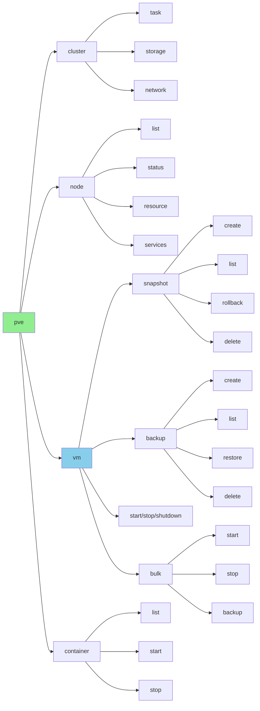
```mermaid
graph LR
    PVE[pve] --> CLUSTER[cluster]
    PVE --> NODE[node]
    PVE --> VM[vm]
    PVE --> CONTAINER[container]

    CLUSTER --> C_TASK[task]
    CLUSTER --> C_STORAGE[storage]
    CLUSTER --> C_NETWORK[network]

    NODE --> N_LIST[list]
    NODE --> N_STATUS[status]
    NODE --> N_RESOURCE[resource]
    NODE --> N_SERVICES[services]

    VM --> V_SNAPSHOT[snapshot]
    VM --> V_BACKUP[backup]
    VM --> V_LIFECYCLE[start/stop/shutdown]
    VM --> V_BULK[bulk]

    V_SNAPSHOT --> S_CREATE[create]
    V_SNAPSHOT --> S_LIST[list]
    V_SNAPSHOT --> S_ROLLBACK[rollback]
    V_SNAPSHOT --> S_DELETE[delete]

    V_BACKUP --> B_CREATE[create]
    V_BACKUP --> B_LIST[list]
    V_BACKUP --> B_RESTORE[restore]
    V_BACKUP --> B_DELETE[delete]

    V_BULK --> BULK_START[start]
    V_BULK --> BULK_STOP[stop]
    V_BULK --> BULK_BACKUP[backup]

    CONTAINER --> CT_LIST[list]
    CONTAINER --> CT_START[start]
    CONTAINER --> CT_STOP[stop]

    style PVE fill:#90EE90
    style VM fill:#87CEEB
```

### Command Quick Reference

| Category | Command | Description |
|----------|---------|-------------|
| **Cluster** | `pve cluster task list` | List cluster tasks |
| | `pve cluster storage list-backup` | List backup storages |
| | `pve cluster network list --node pve1` | List network config |
| **Node** | `pve node list` | List all nodes |
| | `pve node status --node pve1` | Node status |
| | `pve node resource stats --node pve1` | Resource statistics |
| **VM** | `pve vm list` | List all VMs |
| | `pve vm snapshot create --vmid 100 --prefix backup` | Create snapshot |
| | `pve vm backup list --vmid 100` | List backups |
| | `pve vm bulk start` | Start all stopped VMs |
| **Container** | `pve container list` | List containers |

---

## 3. VM Selection System

### Selection Patterns

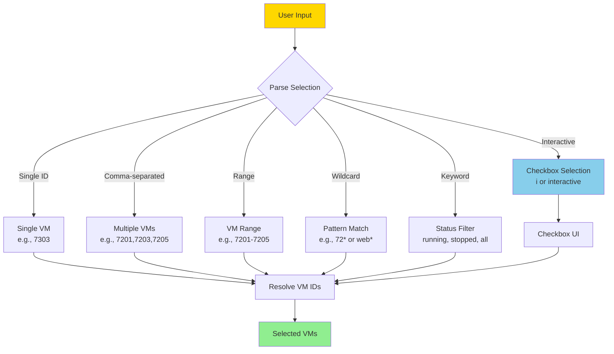
```mermaid
flowchart TD
    INPUT[User Input] --> PARSE{Parse Selection}

    PARSE -->|Single ID| SINGLE[Single VM<br/>e.g., 7303]
    PARSE -->|Comma-separated| COMMA[Multiple VMs<br/>e.g., 7201,7203,7205]
    PARSE -->|Range| RANGE[VM Range<br/>e.g., 7201-7205]
    PARSE -->|Wildcard| WILD[Pattern Match<br/>e.g., 72* or web*]
    PARSE -->|Keyword| KEYWORD[Status Filter<br/>running, stopped, all]
    PARSE -->|Interactive| INTERACTIVE[Checkbox Selection<br/>i or interactive]

    SINGLE --> RESOLVE[Resolve VM IDs]
    COMMA --> RESOLVE
    RANGE --> RESOLVE
    WILD --> RESOLVE
    KEYWORD --> RESOLVE
    INTERACTIVE --> CHECKBOX[Checkbox UI]

    CHECKBOX --> RESOLVE
    RESOLVE --> OUTPUT[Selected VMs]

    style INPUT fill:#FFD700
    style OUTPUT fill:#90EE90
    style INTERACTIVE fill:#87CEEB
```

### Selection Methods

| Pattern | Example | Description |
|---------|---------|-------------|
| Single ID | `--vmid 7303` | Select single VM |
| Multiple IDs | `--vmid 7201,7203,7205` | Comma-separated list |
| Range | `--vmid 7201-7205` | Inclusive range |
| Wildcard (ID) | `--vmid 72*` | Pattern match on VM ID |
| Wildcard (Name) | `--vmname web*` | Pattern match on VM name |
| Keyword: all | `--vmid all` | All VMs |
| Keyword: running | `--vmid running` | All running VMs |
| Keyword: stopped | `--vmid stopped` | All stopped VMs |
| Interactive | `--vmid i` | Checkbox-style selection (v1.2.0+) |

### Checkbox-Style Interactive Selection (v1.2.0+)

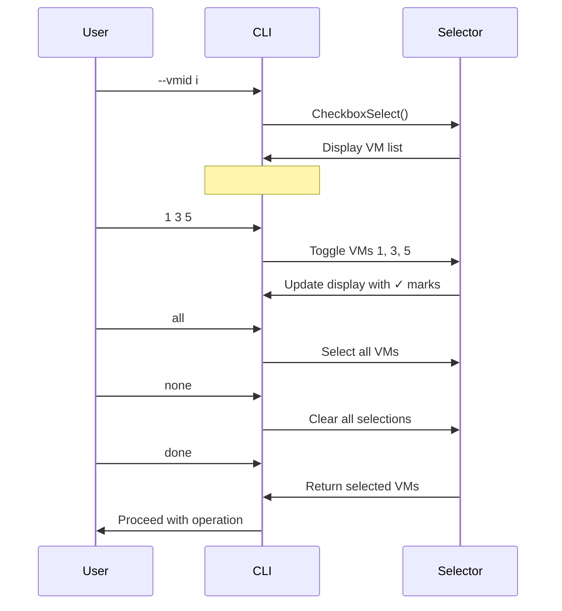
```mermaid
sequenceDiagram
    participant User
    participant CLI
    participant Selector

    User->>CLI: --vmid i
    CLI->>Selector: CheckboxSelect()
    Selector->>CLI: Display VM list
    Note over CLI: # ✓ VM ID Name Status<br/>1   7201  web01  running<br/>2   7202  db01   stopped
    User->>CLI: 1 3 5
    CLI->>Selector: Toggle VMs 1, 3, 5
    Selector->>CLI: Update display with ✓ marks
    User->>CLI: all
    CLI->>Selector: Select all VMs
    User->>CLI: none
    CLI->>Selector: Clear all selections
    User->>CLI: done
    Selector->>CLI: Return selected VMs
    CLI->>User: Proceed with operation
```

**Interactive Commands:**
- `<numbers>` - Toggle VMs by number (space-separated)
- `all` - Select all VMs
- `none` - Clear all selections
- `done` - Finish selection and proceed

---

## 4. Snapshot Operations

### Snapshot Lifecycle

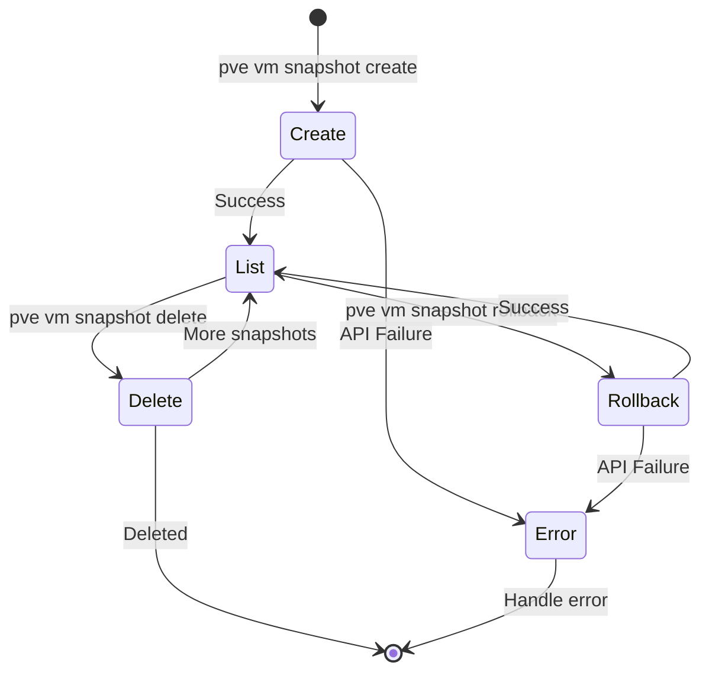
```mermaid
stateDiagram-v2
    [*] --> Create: pve vm snapshot create
    Create --> List: Success
    Create --> Error: API Failure

    List --> Rollback: pve vm snapshot rollback
    List --> Delete: pve vm snapshot delete

    Rollback --> List: Success
    Rollback --> Error: API Failure

    Delete --> [*]: Deleted
    Delete --> List: More snapshots

    Error --> [*]: Handle error
```

### Snapshot Commands

| Command | Flags | Description |
|---------|-------|-------------|
| `pve vm snapshot create` | `--vmid`, `--prefix`, `--name`, `--vmstate` | Create snapshot |
| `pve vm snapshot list` | `--vmid` | List snapshots |
| `pve vm snapshot rollback` | `--vmid`, `--snapshot` | Rollback to snapshot |
| `pve vm snapshot delete` | `--vmid`, `--snapshot`, `--all` | Delete snapshot(s) |

### Snapshot Create Flow

```mermaid
flowchart TD
    START[Start] --> CHECK{VMID specified?}
    CHECK -->|No| ERROR[Error: --vmid required]
    CHECK -->|Yes| RESOLVE[Resolve VM(s)]

    RESOLVE --> NAMING{Naming mode?}
    NAMING -->|Prefix| GEN_NAME[Generate name with timestamp]
    NAMING -->|Exact name| USE_NAME[Use provided name]

    GEN_NAME --> VALIDATE[Validate name length ≤40 chars]
    USE_NAME --> VALIDATE

    VALIDATE --> VMSTATE{Include VM state?}
    VMSTATE -->|Yes| CREATE_RAM[Create with RAM]
    VMSTATE -->|No| CREATE_NO_RAM[Create without RAM]

    CREATE_RAM --> MONITOR[Monitor task progress]
    CREATE_NO_RAM --> MONITOR

    MONITOR --> SUCCESS{Success?}
    SUCCESS -->|Yes| DONE[Snapshot created]
    SUCCESS -->|No| FAIL[Error message]

    style START fill:#90EE90
    style DONE fill:#90EE90
    style ERROR fill:#FF6B6B
    style FAIL fill:#FF6B6B
```

### Multiple Snapshot Delete (v1.2.0+)

```bash
# Delete single snapshot
pve vm snapshot delete --vmid 7303 --snapshot backup-20240101

# Delete multiple snapshots at once
pve vm snapshot delete --vmid 7303 --snapshot snap1,snap2,snap3 -y

# Delete all snapshots
pve vm snapshot delete --vmid 7303 --all -y
```

---

## 5. Backup Operations

### Backup Lifecycle

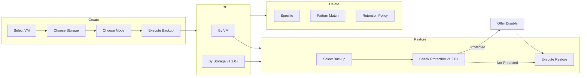
```mermaid
flowchart LR
    subgraph CREATE[Create]
        C1[Select VM]
        C2[Choose Storage]
        C3[Choose Mode]
        C4[Execute Backup]
    end

    subgraph LIST[List]
        L1[By VM]
        L2[By Storage v1.2.0+]
    end

    subgraph RESTORE[Restore]
        R1[Select Backup]
        R2[Check Protection v1.2.0+]
        R3[Execute Restore]
    end

    subgraph DELETE[Delete]
        D1[Specific]
        D2[Pattern Match]
        D3[Retention Policy]
    end

    C1 --> C2 --> C3 --> C4
    C4 --> LIST

    L1 --> RESTORE
    L2 --> RESTORE

    R1 --> R2
    R2 -->|Protected| R2A[Offer Disable]
    R2A --> R3
    R2 -->|Not Protected| R3

    LIST --> DELETE
```

### Backup Modes

| Mode | Description | Use Case |
|------|-------------|----------|
| `snapshot` | Live backup using snapshot | Production VMs (default) |
| `suspend` | Suspend VM during backup | Consistency-critical VMs |
| `stop` | Stop VM during backup | Maximum consistency |

### Backup Commands

| Command | Flags | Description |
|---------|-------|-------------|
| `pve vm backup create` | `--vmid`, `--storage`, `--mode`, `--compress` | Create backup |
| `pve vm backup list` | `--vmid`, `--storage`, `--all` | List backups |
| `pve vm backup restore` | `--vmid`, `--backup-file`, `--node`, `--storage` | Restore backup |
| `pve vm backup delete` | `--vmid`, `--backup-file`, `--pattern`, `--keep-count`, `--max-age-days` | Delete backup(s) |

### Storage-Wide Backup Listing (v1.2.0+)

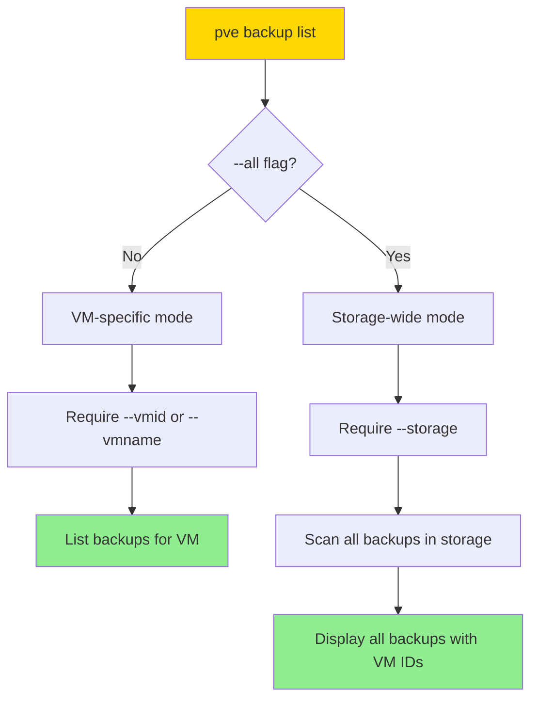
```mermaid
flowchart TD
    LIST[pve backup list] --> CHECK{--all flag?}

    CHECK -->|No| VM_MODE[VM-specific mode]
    VM_MODE --> REQUIRE_VM[Require --vmid or --vmname]
    REQUIRE_VM --> LIST_VM[List backups for VM]

    CHECK -->|Yes| STORAGE_MODE[Storage-wide mode]
    STORAGE_MODE --> REQUIRE_STORAGE[Require --storage]
    REQUIRE_STORAGE --> SCAN_ALL[Scan all backups in storage]
    SCAN_ALL --> DISPLAY_ALL[Display all backups with VM IDs]

    style LIST fill:#FFD700
    style DISPLAY_ALL fill:#90EE90
    style LIST_VM fill:#90EE90
```

**Examples:**
```bash
# List backups for specific VM
pve backup list --vmid 7303

# List ALL backups in storage (new in v1.2.0)
pve backup list --all --storage local-zfs
```

### VM Protection Handling (v1.2.0+)

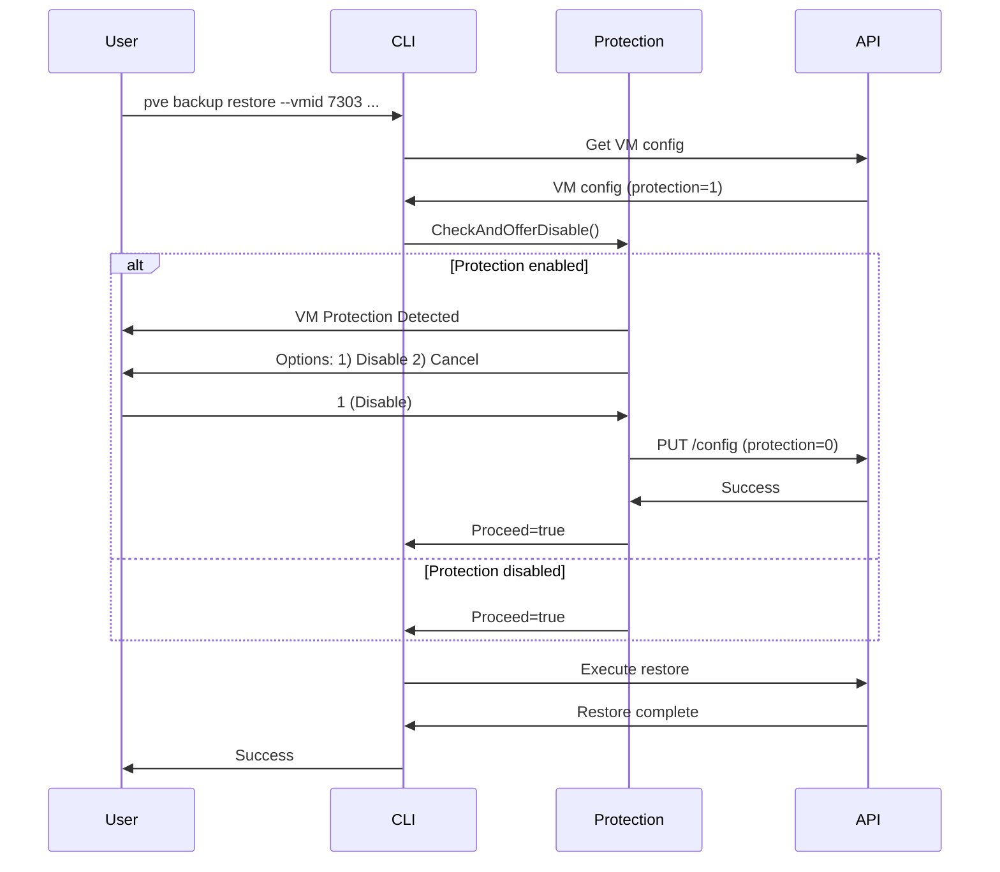
```mermaid
sequenceDiagram
    participant User
    participant CLI
    participant Protection
    participant API

    User->>CLI: pve backup restore --vmid 7303 ...
    CLI->>API: Get VM config
    API->>CLI: VM config (protection=1)
    CLI->>Protection: CheckAndOfferDisable()

    alt Protection enabled
        Protection->>User: VM Protection Detected
        Protection->>User: Options: 1) Disable 2) Cancel
        User->>Protection: 1 (Disable)
        Protection->>API: PUT /config (protection=0)
        API->>Protection: Success
        Protection->>CLI: Proceed=true
    else Protection disabled
        Protection->>CLI: Proceed=true
    end

    CLI->>API: Execute restore
    API->>CLI: Restore complete
    CLI->>User: Success
```

### Backup Retention Policies

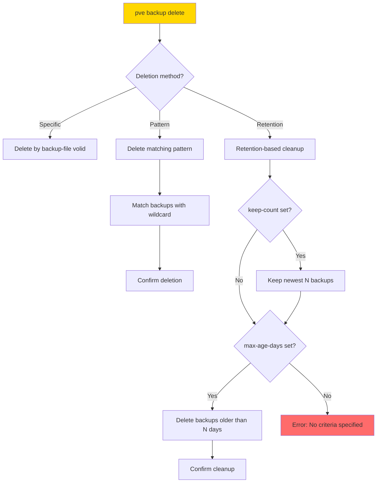
```mermaid
flowchart TD
    DELETE[pve backup delete] --> METHOD{Deletion method?}

    METHOD -->|Specific| BY_FILE[Delete by backup-file volid]
    METHOD -->|Pattern| BY_PATTERN[Delete matching pattern]
    METHOD -->|Retention| BY_RETENTION[Retention-based cleanup]

    BY_PATTERN --> MATCH[Match backups with wildcard]
    MATCH --> CONFIRM1[Confirm deletion]

    BY_RETENTION --> CHECK_KEEP{keep-count set?}
    CHECK_KEEP -->|Yes| KEEP_N[Keep newest N backups]
    CHECK_KEEP -->|No| CHECK_AGE{max-age-days set?}

    KEEP_N --> CHECK_AGE
    CHECK_AGE -->|Yes| DELETE_OLD[Delete backups older than N days]
    CHECK_AGE -->|No| ERROR[Error: No criteria specified]

    DELETE_OLD --> CONFIRM2[Confirm cleanup]

    style DELETE fill:#FFD700
    style ERROR fill:#FF6B6B
```

---

## 6. VM Lifecycle Operations

### VM State Machine

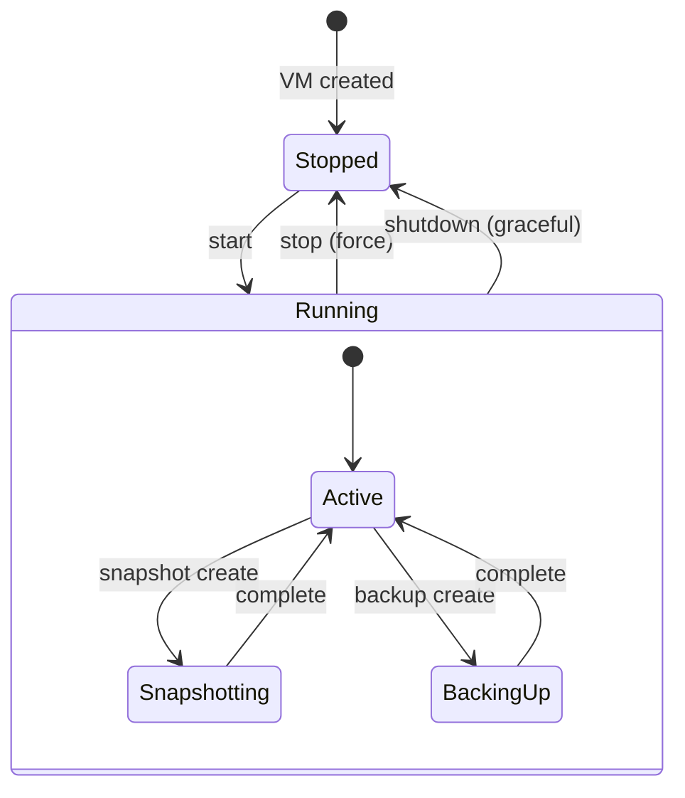
```mermaid
stateDiagram-v2
    [*] --> Stopped: VM created
    Stopped --> Running: start
    Running --> Stopped: stop (force)
    Running --> Stopped: shutdown (graceful)

    state Running {
        [*] --> Active
        Active --> Snapshotting: snapshot create
        Snapshotting --> Active: complete
        Active --> BackingUp: backup create
        BackingUp --> Active: complete
    }
```

### VM Commands

| Command | Description | Example |
|---------|-------------|---------|
| `pve vm list` | List all VMs | `pve vm list` |
| `pve vm details` | Show VM details | `pve vm details --vmid 7303` |
| `pve vm start` | Start VM(s) | `pve vm start --vmid 7303` |
| `pve vm stop` | Force stop VM(s) | `pve vm stop --vmid 7303` |
| `pve vm shutdown` | Graceful shutdown | `pve vm shutdown --vmid 7303` |

### Bulk Operations

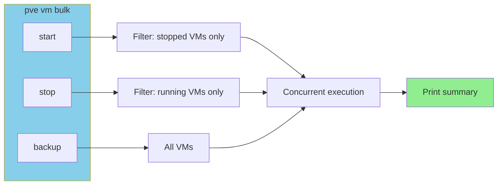
```mermaid
flowchart LR
    subgraph BULK[pve vm bulk]
        START[start]
        STOP[stop]
        BACKUP[backup]
    end

    START --> FILTER1[Filter: stopped VMs only]
    STOP --> FILTER2[Filter: running VMs only]
    BACKUP --> FILTER3[All VMs]

    FILTER1 --> CONCURRENT[Concurrent execution]
    FILTER2 --> CONCURRENT
    FILTER3 --> CONCURRENT

    CONCURRENT --> SUMMARY[Print summary]

    style BULK fill:#87CEEB
    style SUMMARY fill:#90EE90
```

**Bulk Commands:**
```bash
pve vm bulk start                    # Start all stopped VMs
pve vm bulk stop                     # Stop all running VMs
pve vm bulk backup --storage local   # Backup all VMs
```

---

## 7. Cluster Operations

### Cluster Command Flow

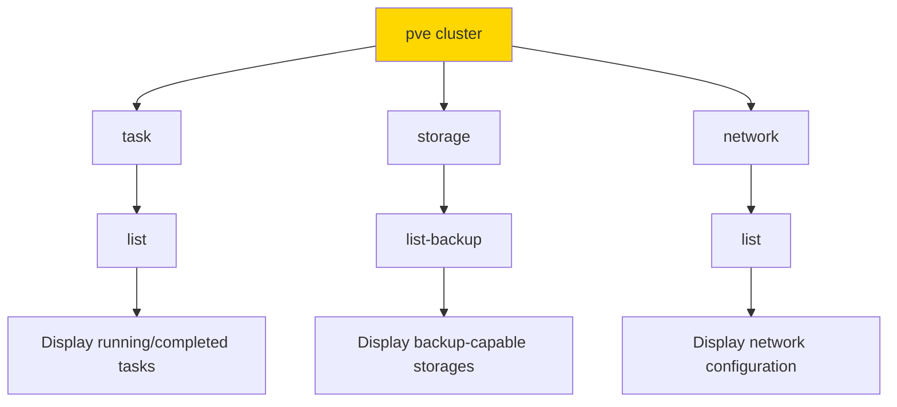
```mermaid
flowchart TB
    CLUSTER[pve cluster] --> TASK[task]
    CLUSTER --> STORAGE[storage]
    CLUSTER --> NETWORK[network]

    TASK --> T_LIST[list]
    T_LIST --> T_DISPLAY[Display running/completed tasks]

    STORAGE --> S_LIST[list-backup]
    S_LIST --> S_DISPLAY[Display backup-capable storages]

    NETWORK --> N_LIST[list]
    N_LIST --> N_DISPLAY[Display network configuration]

    style CLUSTER fill:#FFD700
```

### Cluster Commands

| Command | Description |
|---------|-------------|
| `pve cluster task list` | List cluster tasks |
| `pve cluster storage list-backup` | List backup storages |
| `pve cluster network list --node <name>` | List network config |

---

## 8. Node Operations

### Node Management

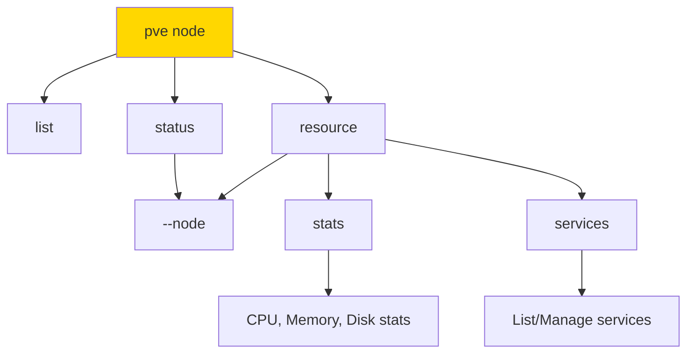
```mermaid
flowchart TB
    NODE[pve node] --> LIST[list]
    NODE --> STATUS[status]
    NODE --> RESOURCE[resource]

    STATUS --> NODE_ARG[--node <name>]
    RESOURCE --> NODE_ARG

    RESOURCE --> R_STATS[stats]
    RESOURCE --> R_SERVICES[services]

    R_STATS --> DISPLAY[CPU, Memory, Disk stats]
    R_SERVICES --> SVC_LIST[List/Manage services]

    style NODE fill:#FFD700
```

### Node Commands

| Command | Description |
|---------|-------------|
| `pve node list` | List all cluster nodes |
| `pve node status --node <name>` | Show node status |
| `pve node resource stats --node <name>` | Resource statistics |

---

## 9. Container Operations

### Container Commands

| Command | Description |
|---------|-------------|
| `pve container list` | List all LXC containers |
| `pve container start --vmid <id>` | Start container |
| `pve container stop --vmid <id>` | Stop container |

---

## 10. Configuration

### Authentication

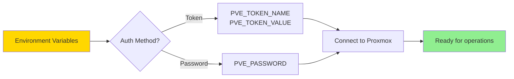
```mermaid
flowchart LR
    ENV[Environment Variables] --> AUTH{Auth Method?}

    AUTH -->|Token| TOKEN[PVE_TOKEN_NAME<br/>PVE_TOKEN_VALUE]
    AUTH -->|Password| PASSWORD[PVE_PASSWORD]

    TOKEN --> CONNECT[Connect to Proxmox]
    PASSWORD --> CONNECT

    CONNECT --> READY[Ready for operations]

    style ENV fill:#FFD700
    style READY fill:#90EE90
```

### Required Environment Variables

| Variable | Description | Required |
|----------|-------------|----------|
| `PVE_HOST` | Proxmox host URL | Yes |
| `PVE_USER` | Username (user@realm) | Yes |
| `PVE_TOKEN_NAME` | API token name | Yes* |
| `PVE_TOKEN_VALUE` | API token value | Yes* |
| `PVE_PASSWORD` | Password (alternative) | Yes** |

*Required for token authentication (recommended)
*Required if not using token authentication

### Token Permissions

```bash
# Grant API token required permissions
pveum aclmod / -token 'username@pam!token-name' -role PVEVMAdmin
```

### Global Flags

| Flag | Short | Description |
|------|-------|-------------|
| `--batch` | | Batch mode (no prompts) |
| `--yes` | `-y` | Auto-confirm operations |
| `--verbose` | `-v` | Verbose output |
| `--quiet` | `-q` | Quiet output |
| `--dry-run` | | Show what would happen |
| `--config` | | Config file path |

---

## 11. CLI Reference

### Complete Command Reference

#### Snapshot Commands
```bash
# Create
pve vm snapshot create --vmid 7303 --prefix backup
pve vm snapshot create --vmid 7303 --name exact-name --vmstate

# List
pve vm snapshot list --vmid 7303

# Rollback
pve vm snapshot rollback --vmid 7303 --snapshot backup-20240101

# Delete
pve vm snapshot delete --vmid 7303 --snapshot backup-20240101
pve vm snapshot delete --vmid 7303 --snapshot snap1,snap2,snap3 -y  # v1.2.0+
pve vm snapshot delete --vmid 7303 --all -y
```

#### Backup Commands
```bash
# Create
pve vm backup create --vmid 7303 --storage local --mode snapshot

# List
pve vm backup list --vmid 7303
pve vm backup list --all --storage local  # v1.2.0+

# Restore
pve vm backup restore --vmid 7303 --backup-file "local:backup/..." --node pve1

# Delete
pve vm backup delete --vmid 7303 --backup-file "local:backup/..." --yes
pve vm backup delete --vmid 7303 --pattern "*2024*" --yes
pve vm backup delete --vmid 7303 --keep-count 5 --yes
pve vm backup delete --vmid 7303 --max-age-days 30 --yes
```

#### VM Commands
```bash
# Lifecycle
pve vm start --vmid 7303
pve vm stop --vmid 7303
pve vm shutdown --vmid 7303

# Info
pve vm list
pve vm details --vmid 7303

# Bulk
pve vm bulk start
pve vm bulk stop
pve vm bulk backup --storage local
```

#### Cluster Commands
```bash
pve cluster task list
pve cluster storage list-backup
pve cluster network list --node pve1
```

#### Node Commands
```bash
pve node list
pve node status --node pve1
pve node resource stats --node pve1
```

#### Container Commands
```bash
pve container list
```

---

## Version History

| Version | Date | Changes |
|---------|------|---------|
| 1.2.0 | 2026-02-16 | Checkbox-style selection, storage-wide backup listing, VM protection disable, multi-snapshot delete |
| 1.1.1 | 2025-12-06 | Multi-platform builds, documentation updates |
| 1.0.0 | 2025-10-09 | Initial Go implementation with AWS-style CLI |

---

## 12. System Architecture Audit

### Package Dependency Graph

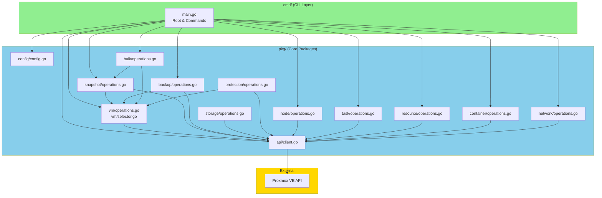
```mermaid
graph TB
    subgraph CMD["cmd/ (CLI Layer)"]
        MAIN[main.go<br/>Root & Commands]
    end

    subgraph PKG["pkg/ (Core Packages)"]
        API[api/client.go]
        CONFIG[config/config.go]

        VM[vm/operations.go<br/>vm/selector.go]
        SNAP[snapshot/operations.go]
        BACKUP[backup/operations.go]
        BULK[bulk/operations.go]
        STORAGE[storage/operations.go]
        PROTECT[protection/operations.go]

        NODE[node/operations.go]
        TASK[task/operations.go]
        RESOURCE[resource/operations.go]
        CT[container/operations.go]
        NET[network/operations.go]
    end

    subgraph EXT["External"]
        PROXMOX[Proxmox VE API]
    end

    MAIN --> API
    MAIN --> CONFIG
    MAIN --> VM
    MAIN --> SNAP
    MAIN --> BACKUP
    MAIN --> BULK
    MAIN --> NODE
    MAIN --> TASK
    MAIN --> RESOURCE
    MAIN --> CT
    MAIN --> NET

    API --> PROXMOX

    VM --> API
    SNAP --> API
    SNAP --> VM
    BACKUP --> API
    BACKUP --> VM
    BULK --> VM
    BULK --> SNAP
    STORAGE --> API
    PROTECT --> API
    PROTECT --> VM
    NODE --> API
    TASK --> API
    RESOURCE --> API
    CT --> API
    NET --> API

    style CMD fill:#90EE90
    style PKG fill:#87CEEB
    style EXT fill:#FFD700
```

### Package Responsibilities

| Package | File | Responsibility | Dependencies |
|---------|------|----------------|--------------|
| **api** | `api/client.go` | HTTP client, authentication, request handling | External: Proxmox API |
| **config** | `config/config.go` | Configuration loading, environment variables | None |
| **vm** | `vm/operations.go`, `vm/selector.go` | VM CRUD, VM selection patterns | api |
| **snapshot** | `snapshot/operations.go` | Snapshot CRUD operations | api, vm |
| **backup** | `backup/operations.go` | Backup lifecycle management | api, vm |
| **bulk** | `bulk/operations.go` | Concurrent bulk operations | vm, snapshot |
| **storage** | `storage/operations.go` | Storage discovery and validation | api |
| **protection** | `protection/operations.go` | VM protection checking | api, vm |
| **node** | `node/operations.go` | Node management and monitoring | api |
| **task** | `task/operations.go` | Task monitoring and management | api |
| **resource** | `resource/operations.go` | Resource usage statistics | api |
| **container** | `container/operations.go` | LXC container operations | api |
| **network** | `network/operations.go` | Network configuration | api |

### Data Flow Architecture

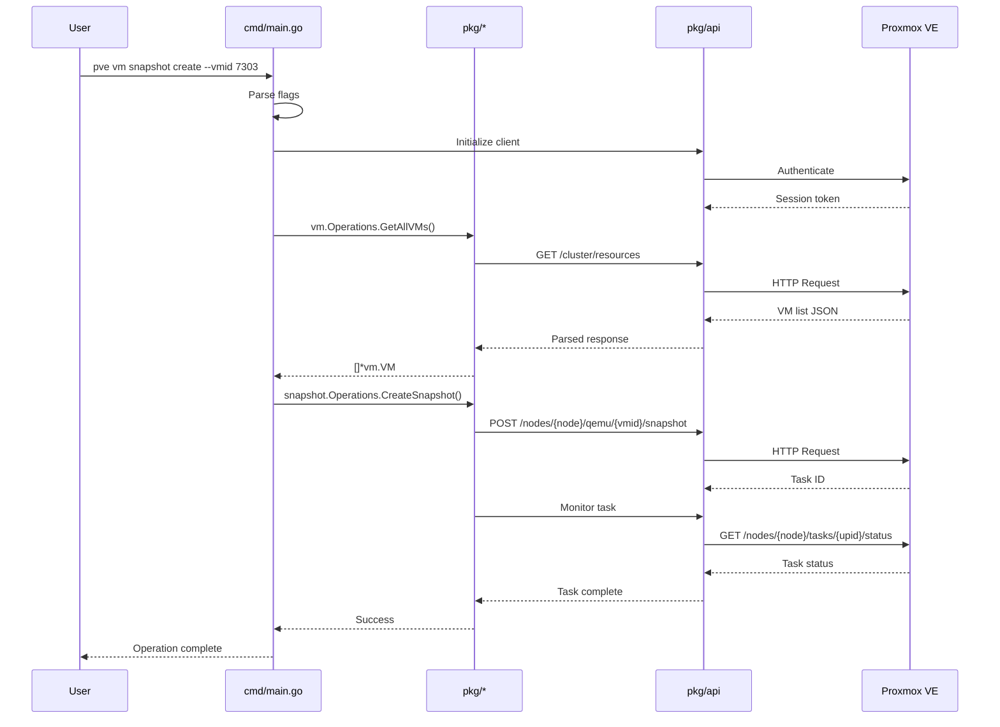
```mermaid
sequenceDiagram
    participant User
    participant CLI as cmd/main.go
    participant Pkg as pkg/*
    participant API as pkg/api
    participant PVE as Proxmox VE

    User->>CLI: pve vm snapshot create --vmid 7303
    CLI->>CLI: Parse flags
    CLI->>API: Initialize client
    API->>PVE: Authenticate
    PVE-->>API: Session token
    CLI->>Pkg: vm.Operations.GetAllVMs()
    Pkg->>API: GET /cluster/resources
    API->>PVE: HTTP Request
    PVE-->>API: VM list JSON
    API-->>Pkg: Parsed response
    Pkg-->>CLI: []*vm.VM
    CLI->>Pkg: snapshot.Operations.CreateSnapshot()
    Pkg->>API: POST /nodes/{node}/qemu/{vmid}/snapshot
    API->>PVE: HTTP Request
    PVE-->>API: Task ID
    Pkg->>API: Monitor task
    API->>PVE: GET /nodes/{node}/tasks/{upid}/status
    PVE-->>API: Task status
    API-->>Pkg: Task complete
    Pkg-->>CLI: Success
    CLI-->>User: Operation complete
```

### Error Handling Strategy

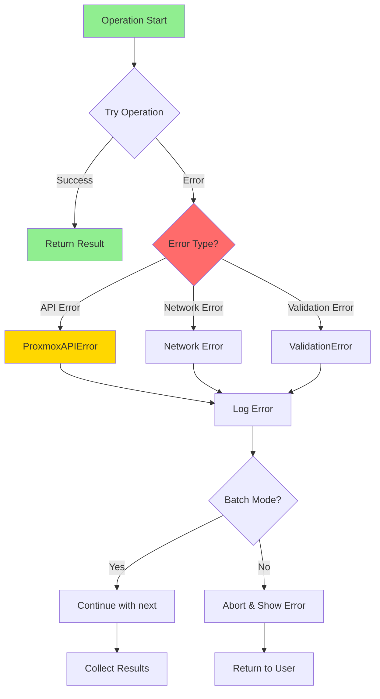
```mermaid
flowchart TD
    OP[Operation Start] --> TRY{Try Operation}
    TRY -->|Success| RETURN[Return Result]
    TRY -->|Error| ERROR{Error Type?}

    ERROR -->|API Error| API_ERR[ProxmoxAPIError]
    ERROR -->|Network Error| NET_ERR[Network Error]
    ERROR -->|Validation Error| VAL_ERR[ValidationError]

    API_ERR --> LOG[Log Error]
    NET_ERR --> LOG
    VAL_ERR --> LOG

    LOG --> CHECK_BATCH{Batch Mode?}
    CHECK_BATCH -->|Yes| CONTINUE[Continue with next]
    CHECK_BATCH -->|No| ABORT[Abort & Show Error]

    CONTINUE --> COLLECT[Collect Results]
    ABORT --> USER[Return to User]

    style OP fill:#90EE90
    style RETURN fill:#90EE90
    style ERROR fill:#FF6B6B
    style API_ERR fill:#FFD700
```

### Concurrency Model

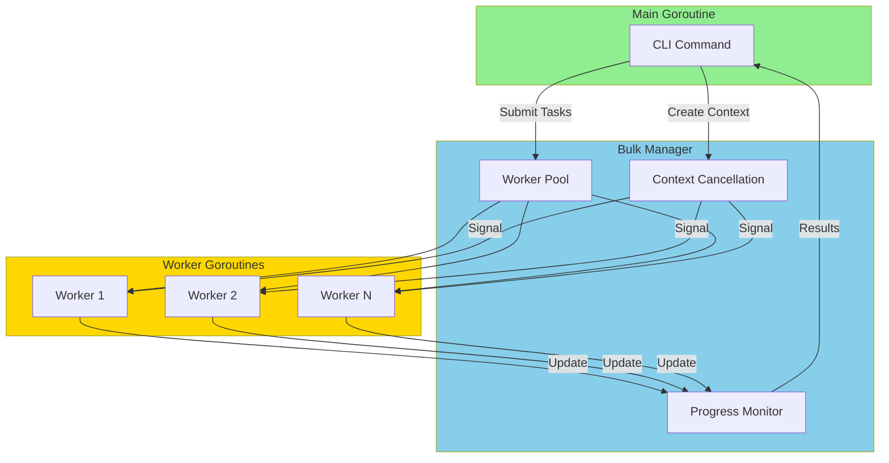
```mermaid
flowchart TB
    subgraph MAIN[Main Goroutine]
        CMD[CLI Command]
    end

    subgraph BULK[Bulk Manager]
        POOL[Worker Pool]
        PROGRESS[Progress Monitor]
        CANCEL[Context Cancellation]
    end

    subgraph WORKERS[Worker Goroutines]
        W1[Worker 1]
        W2[Worker 2]
        W3[Worker N]
    end

    CMD -->|Create Context| CANCEL
    CMD -->|Submit Tasks| POOL
    POOL --> W1
    POOL --> W2
    POOL --> W3

    W1 -->|Update| PROGRESS
    W2 -->|Update| PROGRESS
    W3 -->|Update| PROGRESS

    CANCEL -->|Signal| W1
    CANCEL -->|Signal| W2
    CANCEL -->|Signal| W3

    PROGRESS -->|Results| CMD

    style MAIN fill:#90EE90
    style BULK fill:#87CEEB
    style WORKERS fill:#FFD700
```

### Build & Release Pipeline

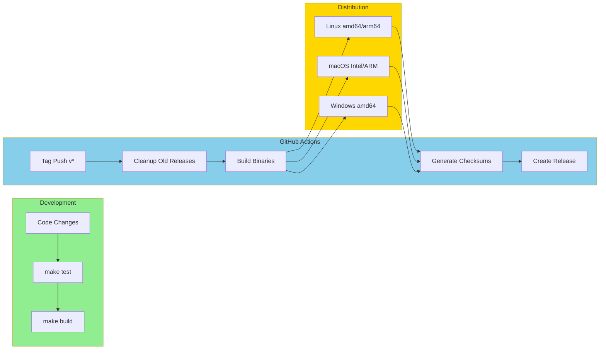
```mermaid
flowchart LR
    subgraph DEV[Development]
        CODE[Code Changes]
        TEST[make test]
        BUILD[make build]
    end

    subgraph CI[GitHub Actions]
        TRIGGER[Tag Push v*]
        CLEANUP[Cleanup Old Releases]
        COMPILE[Build Binaries]
        CHECKSUM[Generate Checksums]
        RELEASE[Create Release]
    end

    subgraph DIST[Distribution]
        LINUX[Linux amd64/arm64]
        MACOS[macOS Intel/ARM]
        WINDOWS[Windows amd64]
    end

    CODE --> TEST --> BUILD
    TRIGGER --> CLEANUP --> COMPILE
    COMPILE --> LINUX
    COMPILE --> MACOS
    COMPILE --> WINDOWS
    LINUX --> CHECKSUM
    MACOS --> CHECKSUM
    WINDOWS --> CHECKSUM
    CHECKSUM --> RELEASE

    style DEV fill:#90EE90
    style CI fill:#87CEEB
    style DIST fill:#FFD700
```

### Security Model

```mermaid
flowchart TB
    subgraph AUTH[Authentication]
        ENV[Environment Variables]
        TOKEN[API Token<br/>Recommended]
        PASS[Password<br/>Alternative]
    end

    subgraph ACL[Proxmox ACL]
        ROLE[PVEVMAdmin Role]
        PERM[Permissions:<br/>VM.Config<br/>VM.PowerMgmt<br/>VM.Snapshot<br/>VM.Backup]
    end

    subgraph PROTECT[Protection]
        CHECK[Check Protection]
        WARN[Warn User]
        DISABLE[Offer Disable]
    end

    ENV --> TOKEN
    ENV --> PASS
    TOKEN --> AUTH_API[Authenticate]
    PASS --> AUTH_API
    AUTH_API --> ACL

    subgraph OPS[Operations]
        CREATE[Create]
        DELETE[Delete]
        RESTORE[Restore]
    end

    ACL --> OPS
    RESTORE --> CHECK
    CHECK --> WARN
    CHECK --> DISABLE

    style AUTH fill:#87CEEB
    style ACL fill:#FFD700
    style PROTECT fill:#FF6B6B
```

### Code Quality Metrics

| Metric | Target | Current | Status |
|--------|--------|---------|--------|
| Test Coverage | >80% | N/A* | ⚠️ Pending |
| Go Vet | 0 issues | 0 issues | ✅ Pass |
| Go Fmt | 100% | 100% | ✅ Pass |
| Build Success | 100% | 100% | ✅ Pass |
| Linter Issues | 0 | 0 | ✅ Pass |

*No unit tests implemented yet; relies on integration testing with live Proxmox

### Known Limitations

| Area | Limitation | Mitigation |
|------|------------|------------|
| Authentication | No OAuth/OIDC support | Use API tokens |
| Bulk Operations | Fixed worker count | Configurable via config |
| Storage | PBS (Proxmox Backup Server) partial support | Use volid format |
| Containers | Limited operations compared to VMs | Ongoing development |
| High Availability | No HA-specific commands | Use Proxmox Web UI |

---

## Deprecation Notice

> **Python CLI Deprecated**: The Python implementation (`python/modular/`) is deprecated as of v1.2.0. All users should migrate to the Go CLI (`pve`). See migration examples in README.md.
